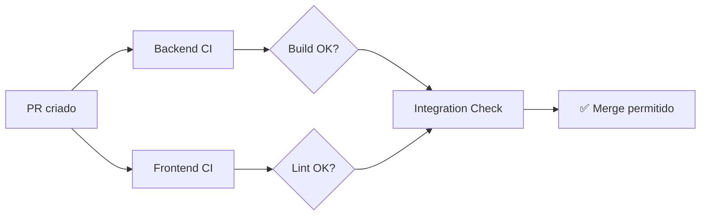
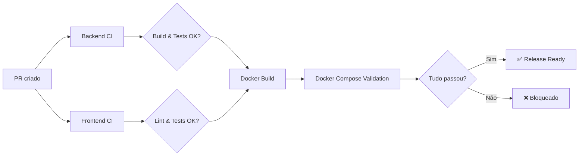

# 🎯 Implementação de CI/CD - ReciclaAI

## ✅ O que foi implementado

### Arquivos Criados

```
recicla-ai_devs-da-gama/
├── .github/
│   ├── workflows/
│   │   ├── dev-pr-ci.yml          # CI para PRs → dev
│   │   └── main-pr-ci.yml         # CI/CD para PRs → main
│   ├── CI_CD_README.md            # Documentação completa
│   └── QUICK_START_CI.md          # Guia rápido
└── backend/
    ├── pyproject.toml             # Configuração pytest
    └── tests/
        ├── __init__.py
        └── test_user_service.py   # Template de teste
```

---

## 🔄 Fluxo de CI Implementado

### PR para DEV (Permissivo - para desenvolvimento)


**Checks**:
- ✅ Build Backend (Python)
- ✅ Build Frontend (React/TS)
- ✅ Linting (ESLint)
- ⚠️ Testes (opcional - não bloqueia)
- ✅ Docker Compose válido

---

### PR para MAIN (Rigoroso - para release)


**Checks**:
- ✅ Build Backend (Python)
- ✅ Build Frontend (React/TS)
- ✅ Linting (ESLint)
- ✅ Testes (OBRIGATÓRIO)
- ✅ Docker Build (ambos)
- ✅ Docker Compose funcional

---

## 📊 Diferenças entre os Workflows

| Aspecto | PRs → DEV | PRs → MAIN |
|---------|-----------|------------|
| **Testes** | Opcional (warning) | **Obrigatório** |
| **Docker Build** | Não | **Sim** |
| **Docker Compose** | Config apenas | **Build + Up** |
| **Bloqueio** | Mais permissivo | **Mais rigoroso** |
| **Objetivo** | Desenvolvimento rápido | Release estável |

---

## 🚀 Como Usar

### 1. Para desenvolvedores trabalhando em features

```bash
# Trabalhe normalmente na sua branch
git checkout -b victor#115

# Quando terminar, teste localmente:
cd backend && pytest tests/ -v
cd ../frontend && npm run lint && npm run build

# Faça o PR para dev
# O CI rodará automaticamente!
```

### 2. Para o Scrum Master no final da sprint

```bash
# Certifique-se de que a dev está atualizada
git checkout dev
git pull

# Teste tudo localmente antes do PR para main:
cd backend
pytest tests/ -v
docker build -t test .

cd ../frontend
npm run lint && npm run build
docker build -t test .

cd ..
docker compose build
docker compose up -d

# Se tudo passou, crie o PR dev → main
# O CI rigoroso rodará!
```

---

## 📚 Próximos Passos para a Sprint 2

### 1. Implementar Testes (TDD)

**Backend** (`backend/tests/`):
- [ ] `test_user_service.py` - Lógica de negócio de usuários
- [ ] `test_residue_service.py` - Lógica de resíduos
- [ ] `test_scheduling_service.py` - Lógica de agendamento
- [ ] `test_collection_service.py` - Lógica de coleta
- [ ] `test_endpoints.py` - Testes de API

**Frontend** (`frontend/src/__tests__/`):
- [ ] Configurar Vitest
- [ ] Testes de componentes
- [ ] Testes de integração

### 2. Adicionar ao `requirements.txt`
```bash
pytest==7.4.3
pytest-asyncio==0.21.1
httpx==0.25.1
```

### 3. Adicionar ao `package.json`
```json
{
  "scripts": {
    "test": "vitest"
  },
  "devDependencies": {
    "vitest": "^1.0.0",
    "@testing-library/react": "^14.0.0"
  }
}
```

---

## 🎓 Recursos de Aprendizado

### TDD (Test Driven Development)
1. Escreva o teste primeiro (Red)
2. Faça o código passar (Green)
3. Refatore (Refactor)

### Pytest (Backend)
```python
@pytest.mark.asyncio
async def test_criar_usuario():
    # Arrange (preparar)
    data = {"nome": "Teste", "email": "test@example.com"}
    
    # Act (agir)
    result = await UserService.criar_usuario(data)
    
    # Assert (verificar)
    assert result is not None
    assert result["email"] == data["email"]
```

### Vitest (Frontend)
```typescript
describe('UserForm', () => {
  it('deve validar email', () => {
    // Arrange
    render(<UserForm />);
    
    // Act
    fireEvent.change(screen.getByLabelText(/email/i), {
      target: { value: 'invalido' }
    });
    
    // Assert
    expect(screen.getByText(/email inválido/i)).toBeInTheDocument();
  });
});
```

---

## 🐛 Troubleshooting

### CI falha mas localmente passa?

**Causa comum**: Diferenças de ambiente

**Solução**:
```bash
# Limpe o cache
rm -rf node_modules/ __pycache__/ .pytest_cache/

# Reinstale dependências
pip install -r requirements.txt
npm ci
```

### Docker build falha no CI?

**Verifique**:
1. Dockerfile está correto?
2. `.dockerignore` não está bloqueando arquivos necessários?
3. Variáveis de ambiente estão configuradas?

**Teste localmente**:
```bash
docker build -t test-local .
docker run test-local
```

---

## 📈 Métricas de Sucesso

Após implementação do CI, esperamos:

- ✅ **0 merges** com código quebrado na main
- ✅ **100%** de cobertura de linting
- ✅ Redução de **bugs em produção**
- ✅ Feedback **imediato** em PRs
- ✅ **Confiança** ao fazer releases

---

## 🙋 Dúvidas Frequentes

**Q: Preciso esperar o CI antes de continuar trabalhando?**
A: Não! Trabalhe em paralelo. O CI roda no GitHub.

**Q: O CI substituiu os testes locais?**
A: Não! Sempre teste localmente primeiro. O CI é a última validação.

**Q: Posso desabilitar o CI temporariamente?**
A: Tecnicamente sim, mas **não recomendado**. É uma proteção importante.

**Q: Como adiciono novos checks ao CI?**
A: Edite os arquivos `.github/workflows/*.yml` e faça commit.

---

## 👥 Responsabilidades

- **Todos os Devs**: Garantir que código passa nos checks antes do PR
- **Revisores de PR**: Verificar que CI passou antes de aprovar
- **Scrum Master**: Garantir que PR dev→main só acontece com CI verde

---

**Implementado em**: Novembro 2025 - Sprint 2  
**Equipe**: Gabriel Lopes, José Victor, Pedro Emanuel, Thalys Yago  
**Disciplina**: Engenharia de Software 2 - UFPI
